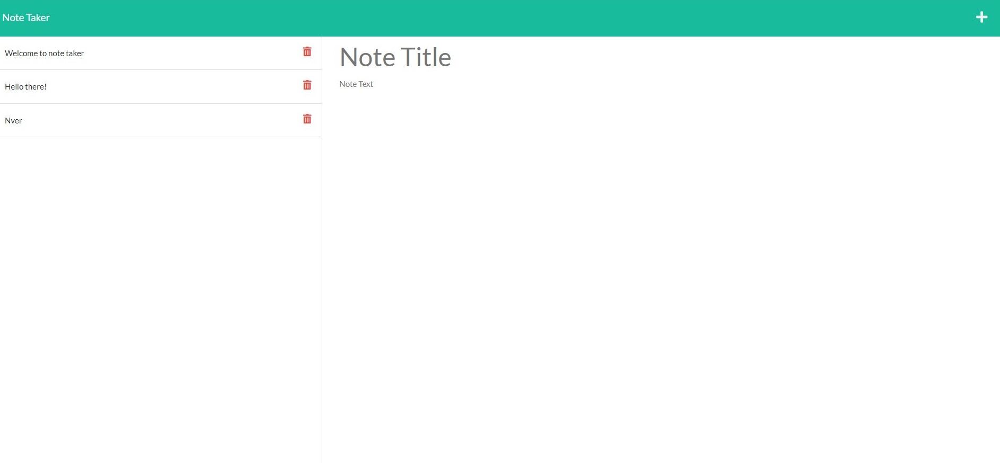
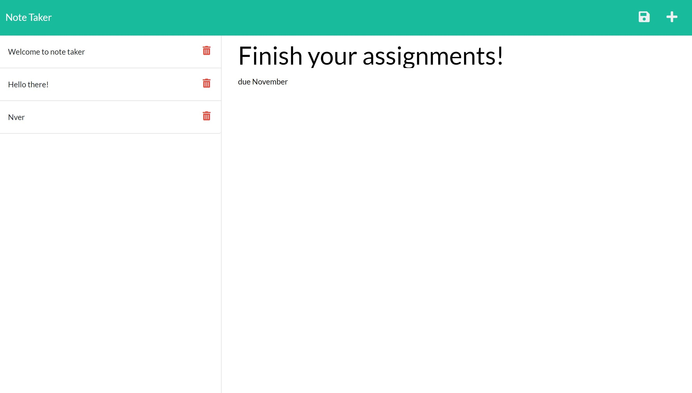

# Note Taker 

## Description:
- This application can be used to write and save notes.

## Summary:
- It's a note taker generator using by Node.js, JavaScript, and Express.

## Table of Content:

* [Description](#description)
* [Summary](#summary)
* [Visuals](#visuals)
* [Tools](#tools)
* [Deployed Link on Heroku](#deployed-link-on-heroku)
* [Usage](#usage)
* [Installation](#installation)
* [License](#license)
* [Contributing](#contributing)
* [Tests](#tests)
* [Contact Information](#contact-informations)
* [Demostration Video](#demo)

## Visuals:

## Tools:
- CSS 
- JavaScript
- CSS 
- Node.js
- Express.js
- <a href="https://dashboard.heroku.com/apps">Heroku</a> 

## Deployed Link on Heroku: 
- https://tiffyalva-note-taker.herokuapp.com/notes

## Usage:
- Create a note taker generator by using Node.js, JavaScript, and Express.js
- Run the application in in the terminal on VS Code and use npm start.
- Heroku

## Installation:
- npm
- Express

## License:

## Contributing:
- N/A

## Tests:
N/A

## Contact Informations:
* GitHub Username: <a href="https://github.com/TiffyAlva">TiffyAlva</a>
* Email: <a href="malito:TiffanyAlvarez54@gmail.com">TiffanyAlvarez54@gmail.com

## Demo:
- <a href="https://drive.google.com/file/d/1oT2Vun4XRBoBiC8VAFPTpG1zTQKYDQfB/view?usp=sharing">Demonstration Video</a> 

